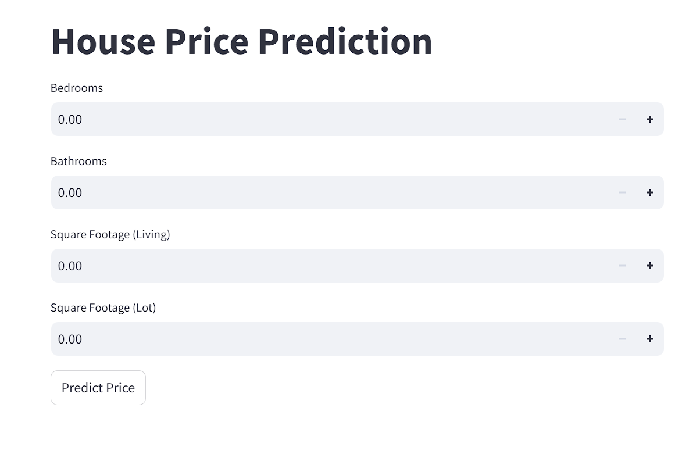

# Prasunet_ML_01
# House Price Prediction



This project demonstrates a linear regression model for predicting house prices based on the number of bedrooms, bathrooms, square footage of living space, and lot size. The model is trained using `scikit-learn` and deployed using a Streamlit web application.

## Table of Contents

- [Introduction](#introduction)
- [Installation](#installation)
- [Usage](#usage)
- [Model Training](#model-training)
- [Streamlit App](#streamlit-app)
- [File Structure](#file-structure)
- [Contributing](#contributing)
- [License](#license)

# Introduction

This project uses a linear regression model to predict the prices of houses. The dataset includes features such as the number of bedrooms, bathrooms, square footage of living space, and lot size. The model is trained on this data and deployed via a Streamlit web app for user interaction.

## Installation

### Prerequisites

- Python 3.6 or higher
- `pip`

### Setting Up the Virtual Environment

1. Clone the repository:
    ```bash
    git clone https://github.com/jayesh-parmarr/Prasunet_ML_01.git
    cd Prasunet_ML_01
    ```

2. Create a virtual environment:
    ```bash
    python -m venv myenv
    ```

3. Activate the virtual environment:
    - **Windows**:
      ```bash
      myenv\Scripts\activate
      ```
    - **macOS and Linux**:
      ```bash
      source myenv/bin/activate
      ```

4. Install the required libraries:
    ```bash
    pip install -r requirements.txt
    ```

## Usage

### Model Training

The model training is completed in the Jupyter notebook file `House_Price_Prediction.ipynb`. You can review and run the notebook for details on data preprocessing, model training, and evaluation.

### Streamlit App

To start the Streamlit web application:
```bash
streamlit run app.py
```

This will open a local web server and allow you to interact with the model through a web interface.

## Model Training

The `House_Price_Prediction.ipynb` notebook handles training the linear regression model. Here are the steps performed in the notebook:

1. **Load the Dataset**:
   - The notebook loads the dataset from `dataset/data.csv`.

2. **Data Preprocessing**:
   - Preprocesses the data, which includes:
     - Scaling features to ensure all input variables contribute equally to the model fitting process.

3. **Model Training**:
   - Trains a linear regression model using the preprocessed data.

4. **Save Trained Model and Scaler**:
   - The notebook saves the trained model (`model.pkl`) and scaler (`scaler.pkl`) using the `pickle` library. This allows for future predictions to be made without retraining the model.

## Streamlit App

The `app.py` script sets up a Streamlit web application that:

- Loads the trained model (`model.pkl`) and scaler (`scaler.pkl`).
- Provides a user interface to input features.
- Scales input features before making predictions.
- Displays the predicted house price.

## File Structure
```bash
Prasunet_ML_01/
├── app.py                     # Streamlit app script
├── House_Price_Prediction.ipynb   # Jupyter notebook for model training
├── requirements.txt           # List of dependencies
├── model.pkl                  # Trained model (generated by notebook)
├── scaler.pkl                 # Scaler (generated by notebook)
├── dataset/
│   └── data.csv               # Dataset file
└── house_price_prediction.png # Image file
```

### Contributing

Contributions are welcome! Please fork this repository and submit a pull request for any features, bug fixes, or enhancements.


## License
This project is licensed under the MIT License. See the [LICENSE](LICENSE) file for details.
